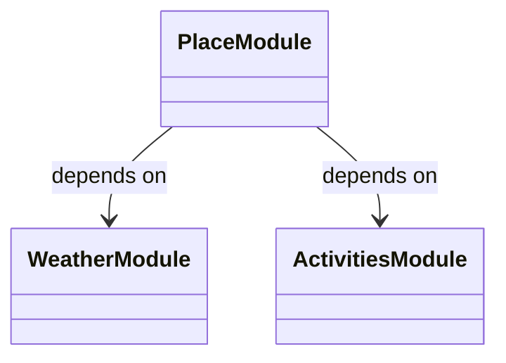
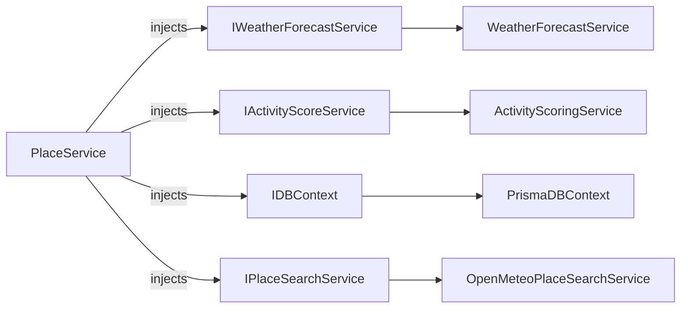
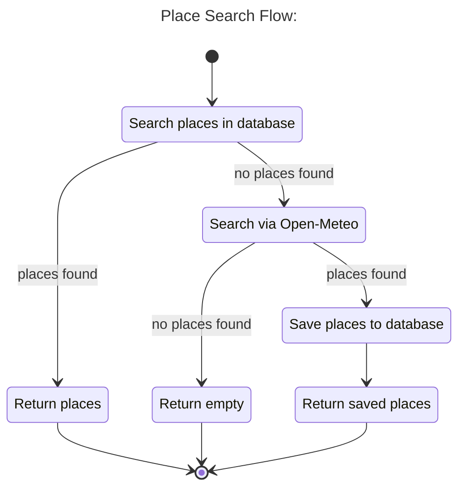
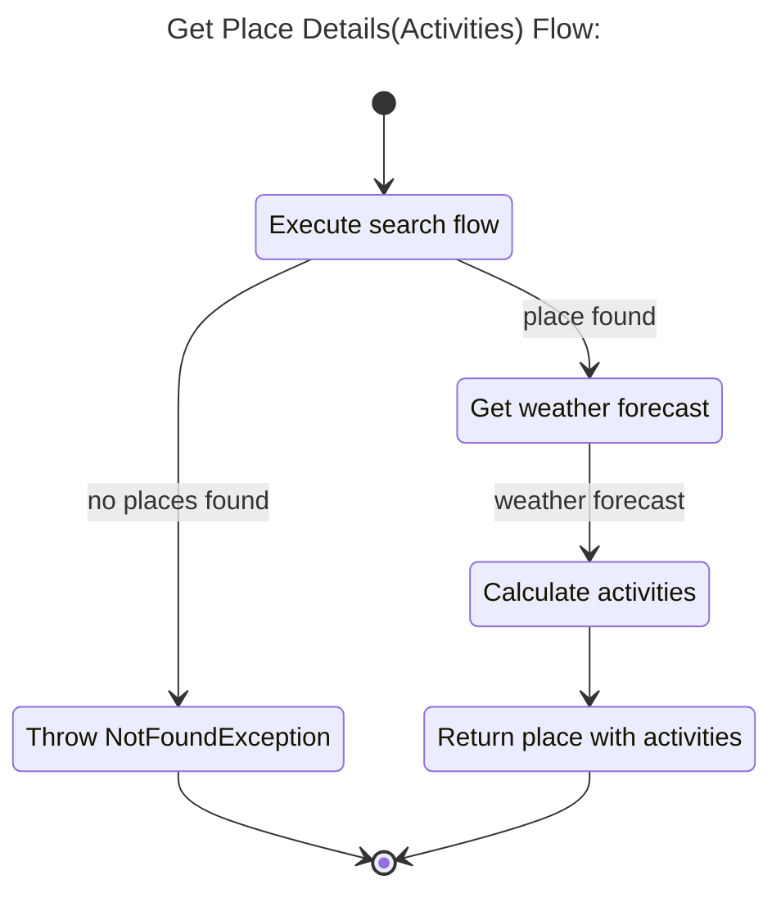

# Place App Backend

NestJS API for place search, weather forecasts, and outdoor activity scoring. It uses PostgreSQL through Prisma and fetches weather/place data from Open-Meteo.

## From The Root README

Back to the [root README](../../README.md).
or  [👉 See Implementation Plan](../../docs/implementation-plan.md)

## Requirements

- Node.js 20+
- pnpm 9

Install dependencies from the current directory:

```bash
pnpm install
```

## Environment Setup

Create a `.env` file for the backend application from the example file:

```bash
cp .env.example .env
```

Update `.env` and set the `DATABASE_URL` variable to your PostgreSQL connection string.

## Run Locally

Run commands from the current directory.

Build all apps and packages:

```bash
pnpm build
```

Apply database migrations:

```bash
pnpm migrate
```

Run all apps in development mode:

```bash
pnpm dev
```

Run tests:

```bash
pnpm test
```


#### Modules structure


#### PlaceService structure



##### PlaceService flows






#### API Service
```typescript
/**
 * Provides place search and place details operations.
 */
export abstract class IPlaceService {
  /**
   * Searches for places matching the supplied criteria.
   *
   * @param params Search parameters.
   * @returns A collection of matching places.
   */
  abstract search(params: ISearchPlacesParams): Promise<IPlace[]>;

  /**
   * Retrieves detailed information for a specific place.
   *
   * @param params Place lookup parameters.
   * @returns Detailed information about the requested place.
   */
  abstract getDetails(params: IPlaceDetailsParams): Promise<IPlaceDetails>;
}
```


```typescript
/**
 * Detailed information about a place for a specific date range.
 */
export interface IPlaceDetails {
  /**
   * Unique identifier of the place.
   */
  id: PlaceId;

  /**
   * Display name of the place.
   */
  name: string;

  /**
   * Date range used to calculate the returned details.
   */
  dateRange: IDateRange;

  /**
   * Activities available for the place along with their recommendation scores.
   */
  activities: IActivity[];
}
```

```typescript
/**
 * Represents an activity and its recommendation score for a place.
 */
export interface IActivity {
  /**
   * The activity category.
   */
  type: ActivityType

  /**
   * Recommendation score for the activity.
   */
  score: {
    /**
     * Recommendation level derived from the calculated score.
     */
    level: RecommendationLevel

    /**
     * Recommendation score expressed as a percentage from 0 to 100.
     */
    percentage: number
  }
}
```


## API

GraphQL queries:

- `searchPlaces(name: String!, count: Int)`
- `getPlaceDetails(name: String!)`

REST endpoints:

- `GET /place/search?name={name}&count={count}`
- `GET /place/details?place={name}`
